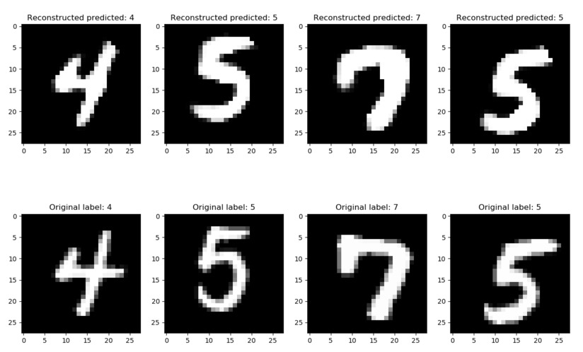

# Capsule Network #

#### PyTorch implementation of the following paper:
* [_Dynamic Routing Between Capsules_](https://arxiv.org/abs/1710.09829) by Sara Sabour, Nicholas Frosst and Geoffrey Hinton

### Official implemenation
* [Official implementation](https://github.com/Sarasra/models/tree/master/research/capsules) (TensorFlow) by Sara Sabour

### Visual represenation

> Image source: _Mike Ross_, [A Visual Representation of Capsule Network Computations](https://medium.com/@mike_ross/a-visual-representation-of-capsule-network-computations-83767d79e737)

### Run the experiment
* For details, run `python main.py --help`

### Example of reconstructed vs. original images

______

### Requirements:
* PyTorch (http://www.pytorch.org)
* NumPy (http://www.numpy.org/)
* GPU

### Default hyper-parameters (similar to the paper):
* Per-GPU `batch_size` = 128
* Initial `learning_rate` = 0.001
* Exponential `lr_decay` = 0.96
* Number of routing iteration (`num_routing`) = 3

#### Loss function hyper-parameters (see [loss.py](loss.py)):
* Lambda for Margin Loss = 0.5
* Scaling factor for reconstruction loss = 0.0005

### GPU Speed benchmarks:
(with above mentioned hyper-parameters)
* Single GeForce GTX 1080Ti - 35.6s per epoch
* Two GeForce GTX 1080Ti - 35.8s per epoch (twice the batch size -> half the iteration)

